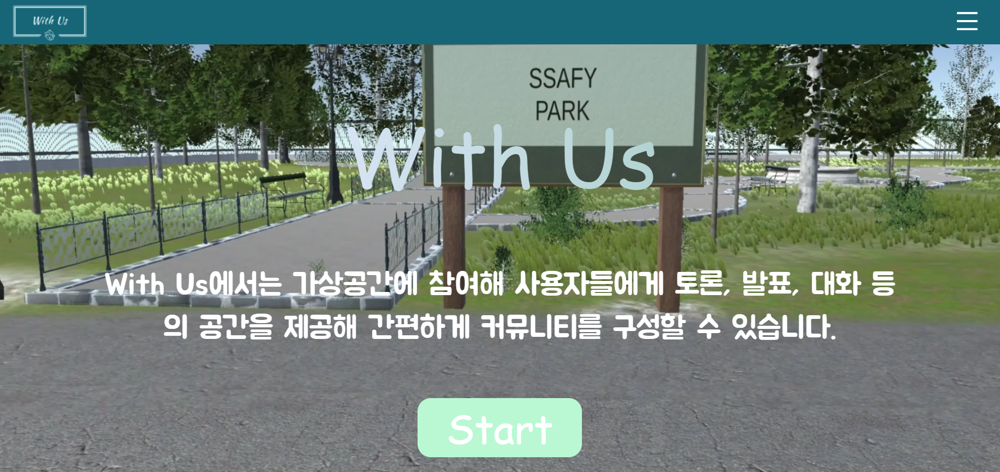
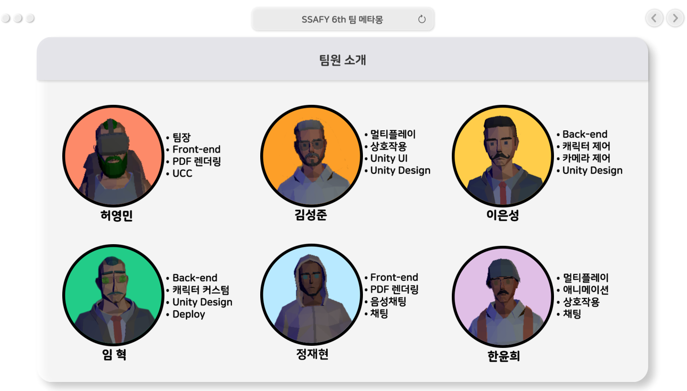
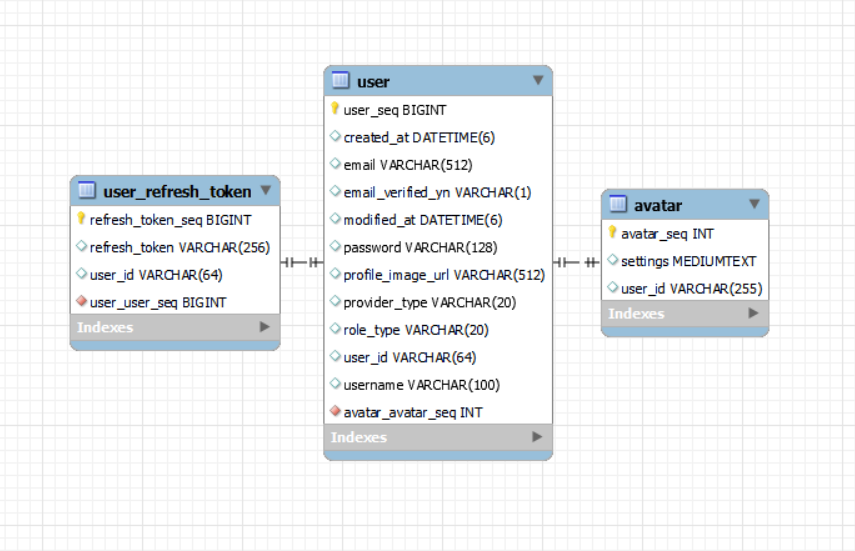
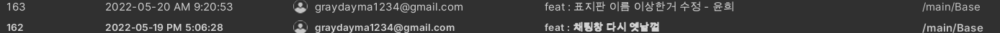
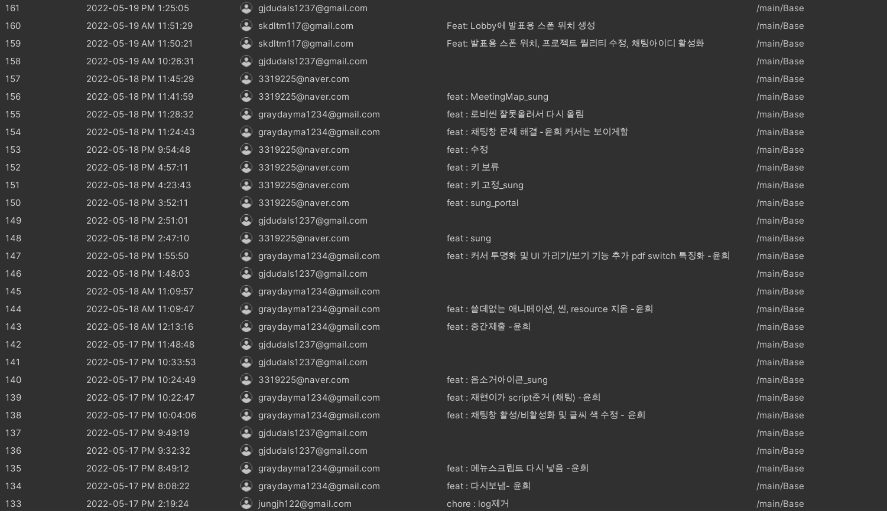
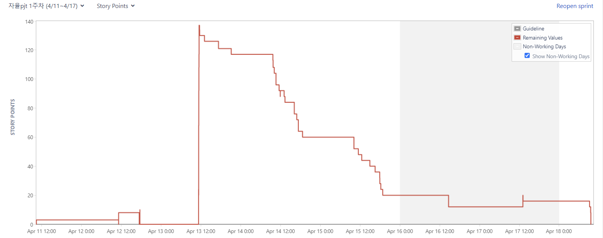

# 위더스(WithUs)

> Metaverse platform for communication like meeting, lecture etc....

WithUs는 우리와 함께라는 뜻으로 웹 기반 가상환경에서 자신의 캐릭터로 간편히 접속할 수 있고 토론, 발표, 협업을 위한 공간을 제공하는 메타버스 플랫폼입니다.




## 📅 Development ( 2022-04-11 ~ 2022-05-27 )

## 팀원소개



## ⚙ 기술 스택 및 개발 환경

```
Backend
JVM zulu-11

DB
Mysql 8.0.28

Frontend
React 18.0.0
node 16.15.0

Server(Amazon EC2)
Ubuntu 20.04 LTS

Storage 
Amazon S3

Deploy
Docker 20.10.14
Docker-compose 1.29.2

IDE
IntelliJ 2021.3.1
Visual Studio Code 
MobaXterm
```


## 아키텍쳐


## 주요기능

| 구분 | 기능                   | 설명                                                         |
| :--: | :--------------------- | :----------------------------------------------------------- |
|  1   | 음성 및 채팅           | 다른 사용자와 소통 할 수 있는 음성, 채팅 기능 제공           |
|  2   | PDF Rendering, WebView | 발표를 위해 발표자료를 올리고 페이지를 넘기는 기능 제공                                                                                 협업을 위한 eraser page, 각종 오락거리 페이지를 보여지게 하는 기능 제공 |
|  3   | 캐릭터 커스터마이징    | 자신만의 캐릭터를 만들고 개성을 부여하는 캐릭터 커마 기능 제공 |
|  4   | Multiplay              | Photon을 이용한 멀티 기능, 닉네임, 캐릭터제어 및 애니메이션 등 동기화 처리가 가능함 |
|  5   | 포탈                   | 포탈을 이용하여 독립적인 공간과 음성채팅 세션을 제공         |


### 실행 방법

#### nginx 설정

```
server {
        listen 80 default_server;
        listen [::]:80 default_server;

        root /home/ubuntu/S06P31C103/Frontend/build;

        # index index.html index.htm index.nginx-debian.html;
        index index.html;
        server_name _;

        location / {
                try_files $uri $uri/ /index.html;
        }
}

server {
    server_name withus.ssafy.io; # managed by Certbot


        location / {
                root /home/ubuntu/S06P31C103/Frontend/build;
                index index.html;
                # First attempt to serve request as file, then
                # as directory, then fall back to displaying a 404.
                try_files $uri $uri/ /index.html;

        }

    listen [::]:443 ssl ipv6only=on; # managed by Certbot
    listen 443 ssl; # managed by Certbot
    ssl_certificate /etc/letsencrypt/live/withus.ssafy.io/fullchain.pem; # managed by Certbot
    ssl_certificate_key /etc/letsencrypt/live/withus.ssafy.io/privkey.pem; # managed by Certbot
    include /etc/letsencrypt/options-ssl-nginx.conf; # managed by Certbot
    ssl_dhparam /etc/letsencrypt/ssl-dhparams.pem; # managed by Certbot

}
server {
    if ($host = withus.ssafy.io) {
        return 301 https://$host$request_uri;
    } # managed by Certbot


        listen 80 ;
        listen [::]:80 ;
    server_name withus.ssafy.io;
    return 404; # managed by Certbot
} 
```


#### nginx 실행

```bash
$ sudo service nginx start
```

---


## Openvidu

#### 기존 openvidu 관련 docker image가 존재한다면 모두 삭제해 주고 시작해야한다.

```bash
$ docker ps -a

#openvidu, kurento media server등의 컨테이너가 존재한다면 삭제한다.
$ docker rm <ID or Name>

#컨테이너 모두 삭제를 원할 경우
$ docker rm $(docker ps -a)

$ docker images

# 이미지도 삭제
$ docker rmi <ID or IMAGE>

# 이미지 전체 삭제를 원할 경우
$docker rmi $(docker images)
```

<br>

### openvidu On premises 설치

```bash
# 관리자 권한
$ sudo su

# openvidu가 설치되는 경로
$ cd /opt

# openvidu on promises 설치
$ curl https://s3-eu-west-1.amazonaws.com/aws.openvidu.io/install_openvidu_latest.sh | bash

$ exit

$ cd openvidu
```


### openvidu 설정 변경

```
DOMAIN_OR_PUBLIC_IP=https://withus.ssafy.io
OPENVIDU_SECRET=MY_SECRET
CERTIFICATE_TYPE=letsencrypt

# NGINX의 포트를 변경한다.
HTTP_PORT=8081
HTTPS_PORT=8443
```

<br>

### 기존 openvidu 인증 파일 삭제

```bash
# /opt/openvidu
$ sudo rm -rf certificates
```


### openvidu-insecure-react 실행

```bash
$ docker run -p 8443:8443 --rm -e OPENVIDU_SECRET=MY_SECRET openvidu/openvidu-server-kms:2.19.0
```

<br>

### openvidu On Promises 실행

```bash
# /opt/openvidu

$ ./openvidu start
```


---


## 백엔드

```bash
# 디렉토리 이동
$ cd S06P31C103

# 백엔드 관련 도커 이미지 실행
$ docker-compose up


# 환경변수(실행 커맨드) : java USE_PROFILE=prod -jar /app.jar
```


## 프론트엔드

```bash
# 프론트엔드 폴더 이동
$ cd S06P31C103/Frontend

# 패키지 인스톨
$ npm i

# 프론트엔드 실행
$ npm start
```


---

## DB 접속 정보

```yaml
 withus-mysql:
    image: mysql:8.0.28
    cap_add:
      - SYS_NICE    
      
    environment:
      MYSQL_ROOT_PASSWORD: "root"
      MYSQL_DATABASE: "withus"
      MYSQL_USER: "withus"
      MYSQL_PASSWORD: "withdbusconn"
    command:
      [
          "--character-set-server=utf8mb4",
          "--collation-server=utf8mb4_unicode_ci"
      ]
    ports: 
      - 3307:3306
```


## ERD




## Project Management

### Unity Commit History





## jira



