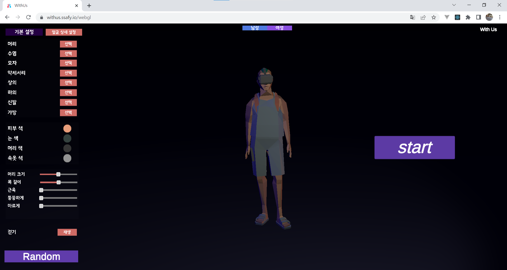
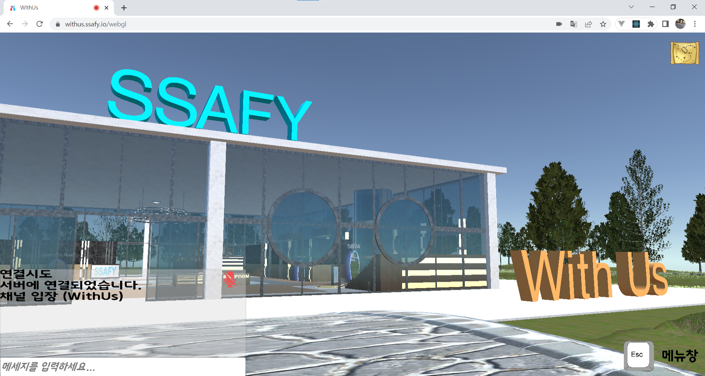
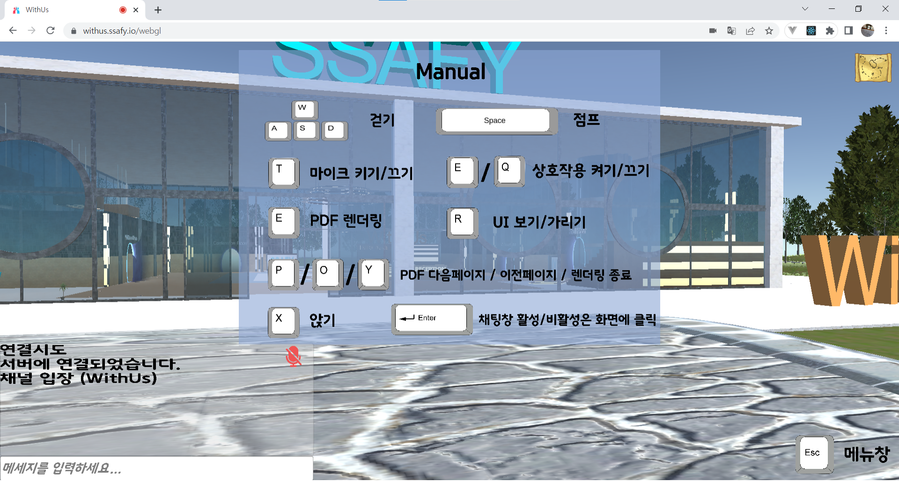
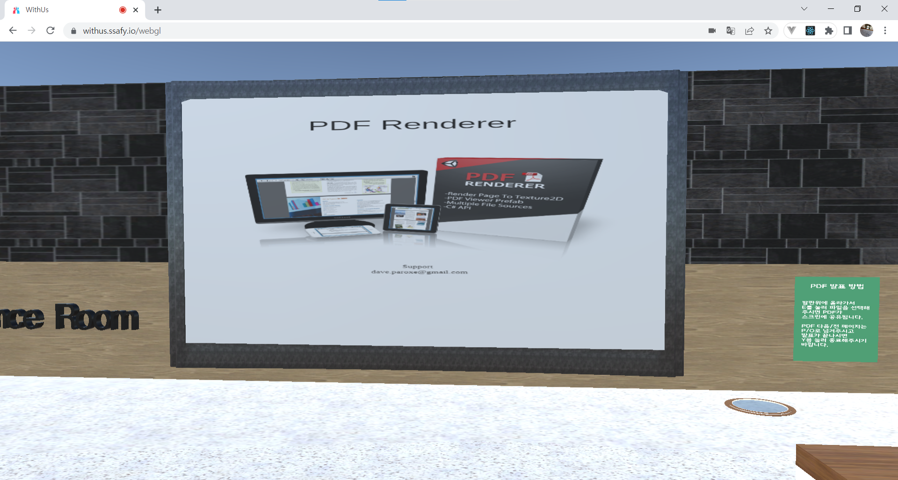
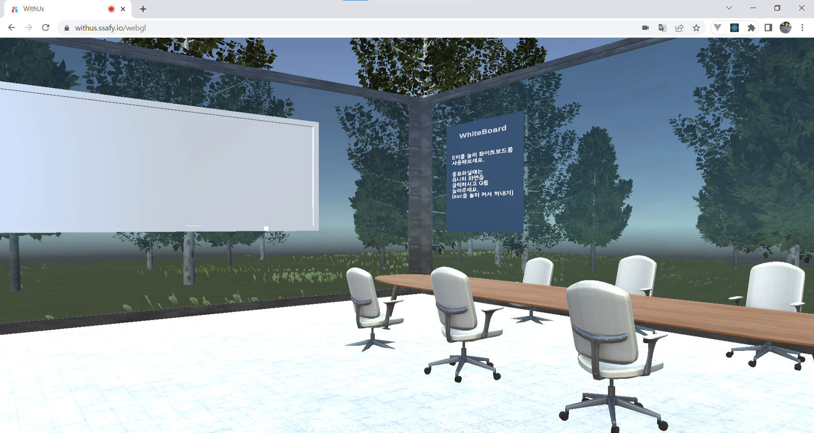
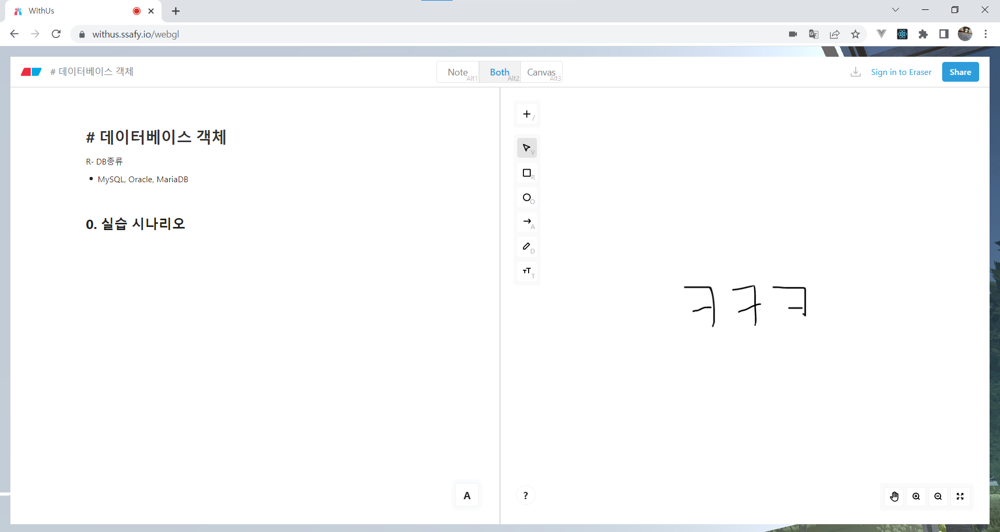
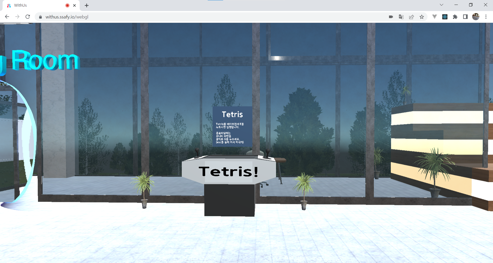

# 1. 캐릭터 커스터마이징

실행 시키면 위와 같이 캐릭터 커스터마이징 창이 나오는데 따로 단축키는 없고 왼쪽에 버튼들을 이용하여 캐릭터를 꾸미고 start 버튼을 눌러서 게임을 실행시키면 됩니다.

# 2. 접속한 뒤 캐릭터가 스폰된 화면

위와 같이 화면이 먼저나오고 유니티로 구현된 화면이다보니 직관적으로 실행시키면 됩니다. 그 외의 조작법은 다음 사진으로 보여드리겠습니다.

# 3. 조작법

esc 키를 누르면 조작법이 나오고 위와 같은 조작법으로 게임을 진행할 수 있습니다.

# 4. 회의실

위의 사진에서 오른쪽 원 발판위에 선 후에 e 를 누르면 pdf를 렌더링 할 수있습니다. 렌더링 후에 P,O 는 다음/이전 페이지로 넘기는 것이고 Y를 누르면 렌더링한 화면을 초기화 시킵니다.

# 5. 회의룸

2층으로 올라가면 위의 사진처럼 회의, 협업등을 할 수있는 공간을 제공해줍니다! 칠판과 책상을 통해 다음 사진과 같이 정보를 메모 할 수 있습니다.

칠판과 책상에 e를 누르는 상호작용을 통해 다음과 같은 화면이 나오고 글쓰는 것과 오른쪽은 그릴 수 있는 서로 메모를 할 수 있는 화면이 나옵니다.

# 6. 기타 (오락기능, 음성)

2층에 올라가면 위의 테트리스 외 2가지의 게임 오브젝트가 있는데 마찬가지로 e를 눌러 상호작용을 하여 게임을 즐길 수 있습니다! 그리고 음성의 경우에는 여기 작성하는 것으로 보여주긴 어렵지만 t키를 눌러 음성을 켜서 서로 대화를 할 수 있습니다. 대화는 방마다 세션이 따로 있어서 방, 로비 있는 사람들끼리 소통이 가능합니다